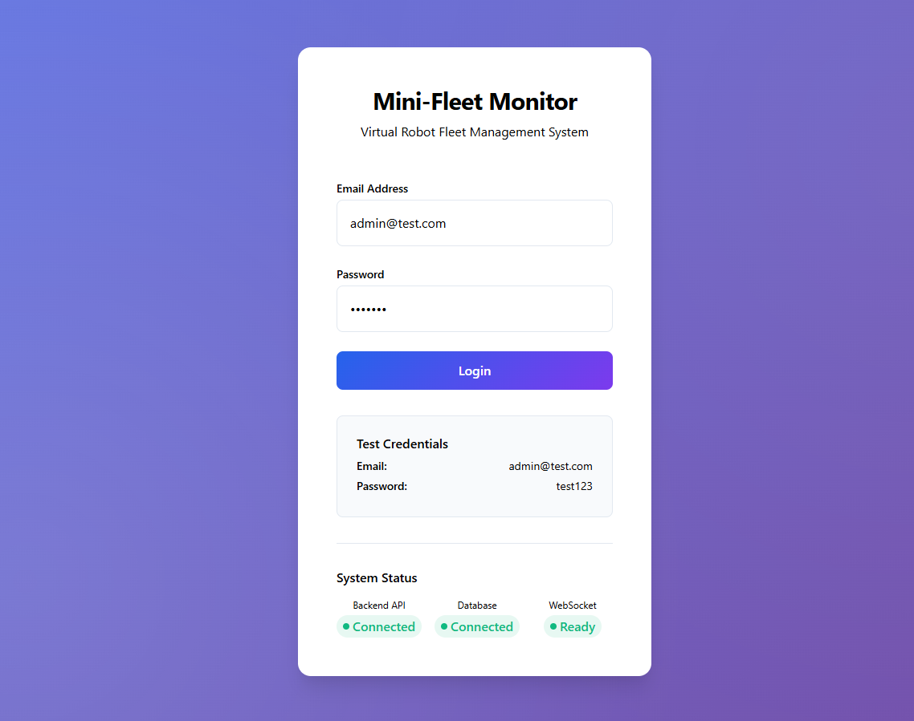
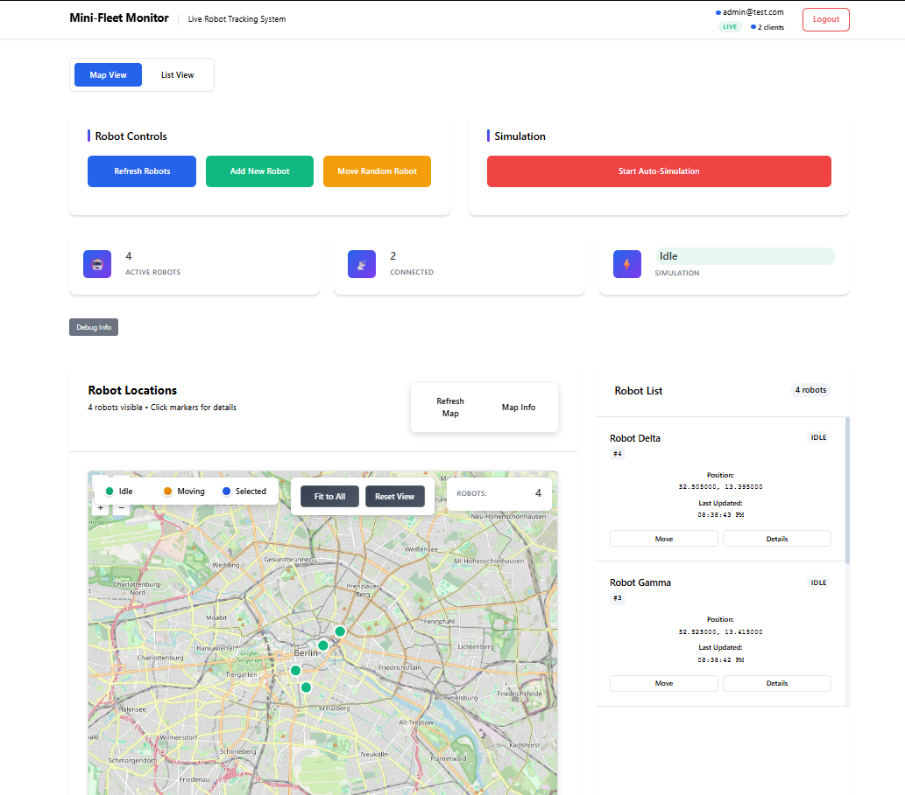
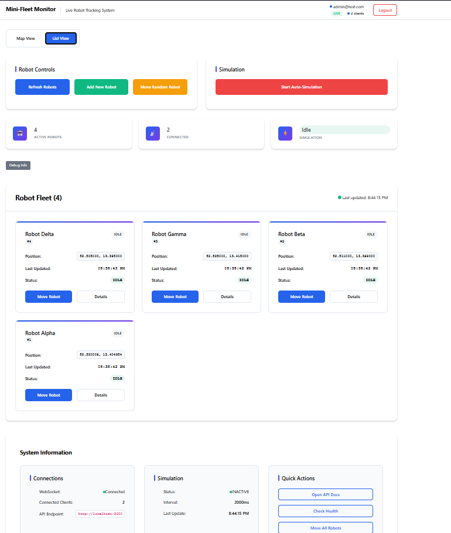
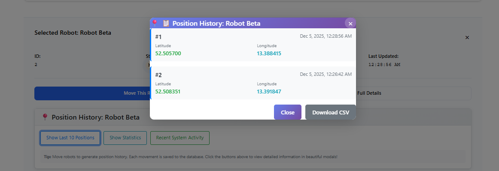

# Mini-Fleet Monitor

Eine vollständige Web-Anwendung zur Verwaltung und Überwachung virtueller Roboter mit Echtzeit-Positionsupdates.

## Setup-Schritte

### Voraussetzungen

- Docker & Docker Compose
- Node.js 18+ (für lokale Entwicklung)

### Installation & Start

1. Repository klonen
```bash
git clone https://github.com/Hannes-Hu/mini-fleet-monitor
cd mini-fleet-monitor
```

2. Docker Compose starten

```bash
docker-compose up --build
```

3. Anwendung öffnen

Frontend: http://localhost:8080
Backend: http:/localhost:3000

4. Login mit Standard-Zugangsdaten

E-Mail: admin@test.com
Password: test123

### Alternative: Manuelle Installation ohne Docker

Backend Setup
```bash
cd backend
npm install
# PostgreSQL und Redis müssen laufen
# Datenbank-URL in .env setzen
npm start
```

Frontend Setup
```bash
cd frontend
npm install
npm start
```

Datenbank Initialisieren
```bash
# Datenbank-Schema erstellen
npm run init-db
# Testdaten einspielen
npm run seed
```

## Architektur

Die Anwendung folgt einer modernen Microservices-Architektur mit React-Frontend, Node.js/Express-Backend, PostgreSQL als Hauptdatenbank und Redis für Caching und Echtzeit-Updates. Die Kommunikation zwischen Frontend und Backend erfolgt über REST-APIs für Datenabfragen und WebSockets für Live-Positionsupdates. Ein automatischer Simulationsservice bewegt die Roboter alle 2 Sekunden, während JWT-Tokens die Authentifizierung sicherstellen.

## Screenshots

### Login- Seite


*Login-Maske mit Standard-Zugangsdaten*

### Dashboard mit Karte


*OpenLayers-Karte mit Robotern als Marker*

### Roboter Liste


Liste aller Roboter mit Details und Steuerungsbuttons

### Positionsverlauf


*Positionsverlauf und Reise-Statistiken*

# Features
## Muss- Kriterien (vollständig implementiert)

-  Backend: Node.js + Express mit PostgreSQL und Redis
- Frontend: React mit OpenLayers-Karte
- Authentifizierung: JWT-basierter Login
- Datenmodell: Users & Robots Tabellen
- API-Endpunkte: Login, Roboter abrufen, Position simulieren
- Echtzeit-Updates: WebSocket für Live-Positionsupdates
- Simulation: Automatische Positionsupdates alle 2 Sekunden
- Docker Compose: Vollständige Container-Umgebung

## Optionale Erweiterungen (implementiert)

- Roboter hinzufügen: POST /api/robots
- Redis-Cache: GET /robots Ergebnisse (TTL 10s)
- Redis Pub/Sub: Für skalierbare Updates
- Positionshistorie: robot_positions Tabelle
- Steuer-Buttons: Start/Stop Simulation im Frontend
- Reise-Statistiken: Distanzberechnung und Position History

# Technologien

## Backend

- Node.js (18.x) - JavaScript Runtime
- Express - Web Framework
- PostgreSQL - Relationale Datenbank
- Redis - In-Memory Cache & Pub/Sub
- JWT - JSON Web Tokens für Authentifizierung
- WebSocket - Echtzeit-Kommunikation
- Docker - Containerisierung

## Frontend

- React (18.x) - UI Framework
- OpenLayers (8.x) - Interaktive Karten
- Bootstrap - CSS Framework
- WebSocket Client - Echtzeit-Updates
- Axios - HTTP Client

# API Endpunkte

## Authentifizierung

- POST /auth/login - Login mit Email/Passwort → JWT Token

## Roboter (geschützt)

- GET /robots - Alle Roboter abrufen
- GET /robots/:id - Einzelnen Roboter abrufen
- POST /robots - Neuen Roboter erstellen
- POST /robots/:id/move - Roboterposition simulieren
- GET /robots/:id/positions - Positionsverlauf abrufen
- GET /robots/:id/statistics - Reise-Statistiken

## Simulation

- POST /simulation/start - Automatische Simulation starten
- POST /simulation/stop - Simulation stoppen
- GET /simulation/status - Simulationsstatus abrufen

## System
- GET / - API Information
- GET /health - Health Check
- GET /ws/stats - WebSocket-Statistiken
- WS /ws - WebSocket für Echtzeit-Updates

# Tests
```bash
# Backend Tests
cd backend
npm test

# Frontend Tests
cd frontend
npm test
```
